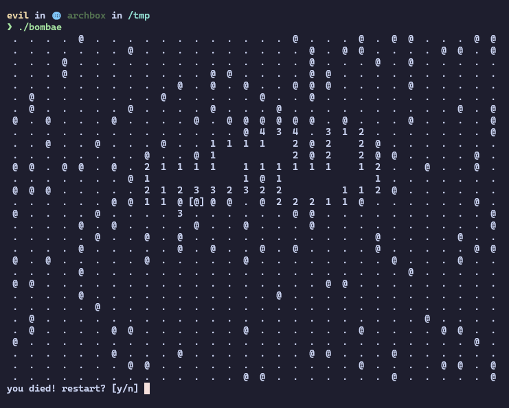

<div align="center">
<h1>bombae</h1>

samarth kulshrestha


<br>

<br/><br/><br/>

<br/><br>
</div>

## Introduction

**bombae** is a terminal minesweeper game, written in pascal.

## Usage

+ clone the repository
```console
$ git clone https://github.com/samarthkulshrestha/bombae.git
$ cd bombae
```

+ compile (it is written in [free pascal](https://www.freepascal.org/download.html))
```console
$ fpc bombae.pas
```

+ run the executable
```console
$ ./bombae
```

## Contribute

+ I <3 pull requests and bug reports!
+ Don't hesitate to [tell me my code-fu sucks](https://github.com/samarthkulshrestha/bombae/issues/new), but please tell me why.
+ Feel free to fork the project and try out your own optimisations.

## License

bombae is licensed under the MIT License.

Copyright (c) 2024 Samarth Kulshrestha.
